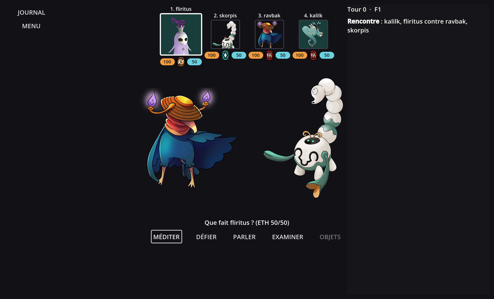
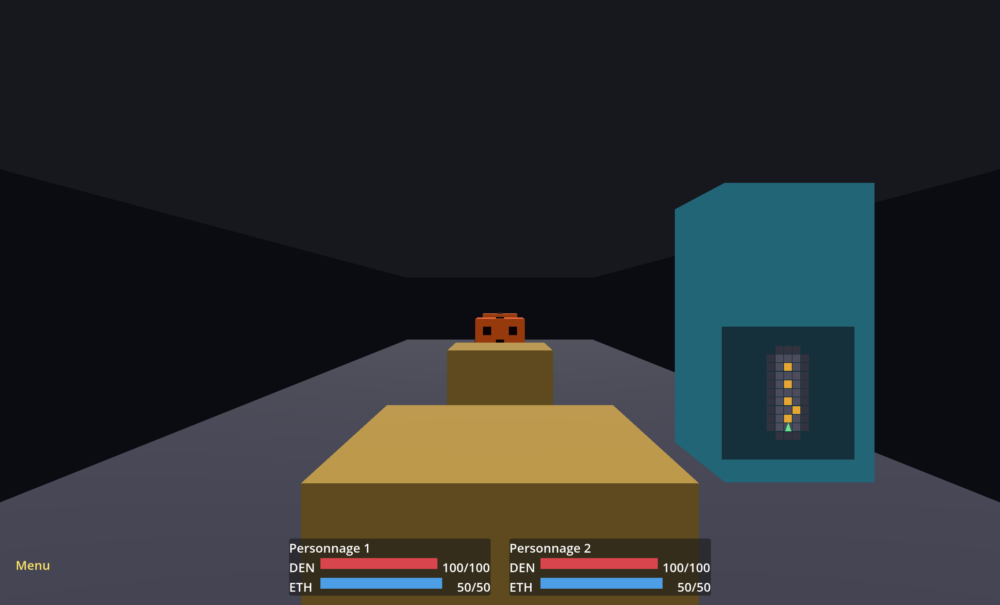

# Spiritology

A monster-cataloguing dungeon crawler RPG, built in Godot 4.

You explore dungeons as a **duo** of spirimonsters, meet others, and fill an encyclopaedia
about them. Fights are not the only way through an encounter — talking to a rival,
examining it, or handing it an object all earn information points, and a species whose
page you have completed becomes easier to face.



*An encounter. Turn order runs along the top — position in it decides which weakness each
individual currently exposes, which is why abilities that reorder the turn are attacks.*



*Exploration. The dungeon geometry is placeholder blocks; species art exists for 7 of the 36.*

## Status

This is a work in progress, and the parts that do not work yet are worth stating plainly:

- **Encounters** — the loop is complete and covered by regression checks: turn order,
  position-dependent weaknesses, damage modifiers, the 111 abilities and the 10 talents.
  **8 of the 111 abilities** are not implemented (their scripts carry `# @unimplemented`
  and fall back to generic per-tag effects, which is a scaffold, not the real mechanic).
- **Exploration** — dungeon geometry, traps, chests, gates, stairs, lifts, narrow bridges,
  crumbly ground and rival AI all run, with headless checks for each.
- **Talents** — all 10 are wired into the loop. Several are limited by systems that do not
  exist yet: there is no dialogue system, no fleeing, and rivals carry no objects, so those
  talents currently log their intent rather than act on it.
- **Balance numbers are placeholders.** The design doc writes them as `X %` and `Y DEN`;
  they can only be settled by playing. `docs/data-model.md` lists every one of them.
- No audio, no save/load UI, no dungeon content beyond the test scenarios.

The 81 `TODO` markers in the source are indexed in **[docs/roadmap.md](docs/roadmap.md)**,
grouped by what they are waiting on. Most are not debt: they are one system waiting on
another that does not exist yet.

## Running it

Requires **Godot 4.6**. No build step — open the project, or launch it straight from the
command line and skip the editor entirely:

```bash
godot --path .
```

That opens a scenario picker: each button builds a dungeon exercising one mechanism, and
the duo's species is chosen in the header. Walking into a rival opens an encounter.

## Checks

```bash
./tools/run_checks.sh     # headless regression suite (~25 s)
./tools/parse_check.sh    # parses every GDScript file (~45 s)
```

Two things headless checks cannot judge are covered by screenshot scenes, which open a
window briefly and write a PNG — no editor involved:

```bash
godot --path . res://scenes/dev/encounter_shot.tscn -- shot.png
godot --path . res://scenes/dev/screenshot.tscn -- chests shot.png
```

`run_checks.sh` runs every `scenes/dev/*_check.tscn`, each a real regression harness that
exits non-zero on failure. It also catches the two ways Godot fails quietly: a check whose
script does not compile (the scene loads without it and never terminates — hence the
timeout) and errors reported on stdout with a zero exit code.

On a fresh clone it first rebuilds Godot's global class cache, which only the editor
generates and without which no `class_name` resolves.

Set `GODOT` if the binary is not at the macOS default path.

## Layout

| | |
|---|---|
| `data/` | game design data — species, abilities, talents, objects. Hand-maintained, and the source of truth |
| `scripts/encounter/` | the encounter loop, ability effects, talents |
| `scripts/exploration/` | dungeon, mechanisms, rival AI |
| `scripts/dev/` | regression harnesses and the test-scenario catalogue |
| `translations/` | `en.po` / `fr.po` — all displayed text, no string is hard-coded |
| `docs/` | [data model](docs/data-model.md), [what isn't built](docs/roadmap.md) |

## Licence

**Dual-licensed, with the boundary following the directory tree:**

| | |
|---|---|
| `assets/`, `data/`, `translations/` | [LAL-1.3](LICENSES/LAL-1.3.txt) — Free Art License |
| everything else | [GPL-3.0-or-later](LICENSES/GPL-3.0-or-later.txt) |

> GitHub shows a single licence badge, and it does not recognise the Free Art License, so
> the interface will report this repository as GPL only. Half of it is not. `REUSE.toml`
> is authoritative, and `reuse lint` runs in CI.

Nereus Games LLC also distributes proprietary binaries of the game on some platforms. See
[CONTRIBUTING.md](CONTRIBUTING.md) — it matters if you intend to contribute.

## Credits

- **Nereus Games LLC** — production
- **al** — game design, programming
- **Néd J.** — game design, level design, art

Both licences require attribution; see [AUTHORS](AUTHORS).
