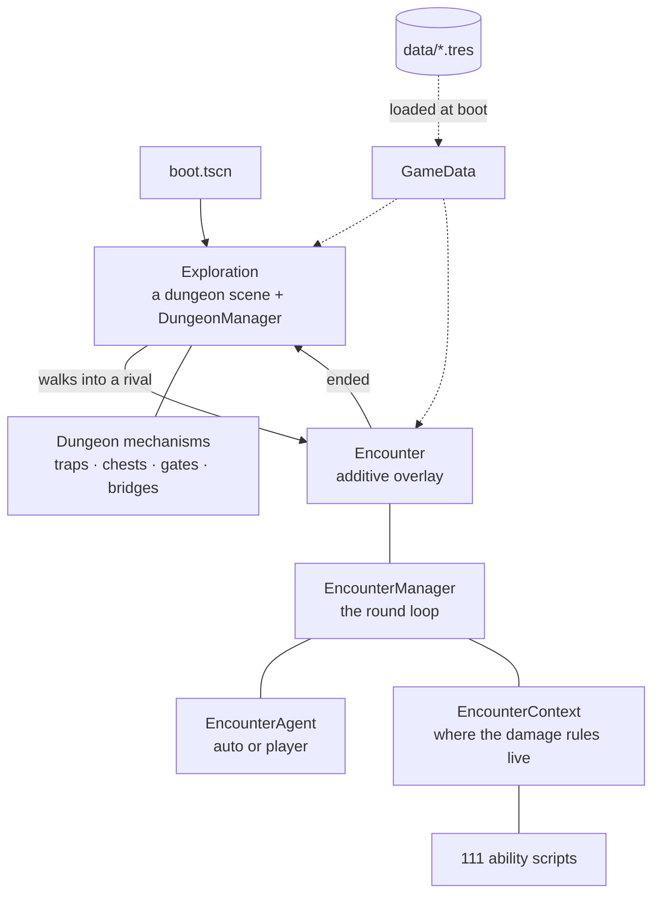

# Architecture

Three pillars — exploration, encounters, the encyclopaedia — over four autoloads and a
directory of data. This is the shape of the thing and the reasoning behind the parts that
are not obvious; [data-model.md](data-model.md) covers the data, [roadmap.md](roadmap.md)
covers what is missing.

## Data is loaded whole, assets are not

`GameData` loads **every** `.tres` at boot — species, abilities, talents, objects, dungeons.
It is a few hundred small text files, the cost is invisible once, and it buys freedom from
micro-freezes mid-dungeon.

Heavy assets are the opposite. Sprites are stored as String **paths**, never as exported
`Texture2D`, because an exported texture would be pulled into memory along with the `.tres`
that mentions it. They are preloaded per dungeon instead, from the species a given
`DungeonConfig` says can appear there.

The four autoloads: **`GameData`** (the static registry), **`GameSession`** (everything a
playthrough accumulates and that must be saved), **`SaveSystem`** (JSON),
**`TransitionManager`** (fades, scene changes, and opening encounters).

## An encounter is an overlay, not a scene change

`TransitionManager.open_encounter` instantiates `encounter.tscn` **additively** on top of
the running exploration scene, which is paused (`process_mode = DISABLED`) and stays loaded
and visible behind the 2D UI. No unload, no reload, no state to rebuild, and the dungeon
remains behind the encounter.

One consequence worth knowing: the exploration HUD lives on its own `CanvasLayer`, which
pausing does not hide, so it would sit on top of the encounter UI. `TransitionManager`
hides those layers explicitly and restores only the ones that were actually visible.

## The encounter loop, and the seam through it

`EncounterManager` runs an encounter per ROUND: everyone acts once, per-turn state is wiped
at the start, pending reordering is applied at the end.

It does not **decide** anything. Each turn it asks the individual's `EncounterAgent`:

- `AutoAgent` answers immediately, so an encounter resolves in one go without suspending.
- `UiAgent` emits `choice_requested` and awaits, so the loop suspends until a person answers.

Because the manager always does `await agent.decide(...)`, the loop is written once and
never branches on who is playing. That is what makes the whole encounter system testable
headless — `scripts/dev/encounter_check.gd` runs 108 abilities and full encounters with no
window at all, which is only possible because nothing in the loop assumes a UI.

The same seam is why `EncounterManager` deliberately knows nothing of `GameSession`.
Reaching for an autoload would tie it to a running game; instead it announces what happened
(`ifp_earned`, `object_consumed`) and the encounter UI relays it.

**Turn order is drawn at random and is load-bearing.** An individual's position — first,
in-between, last — decides which of its species' three weaknesses is currently exposed. So
reordering the turn is an attack, not a flourish, and an order fixed at "players then
rivals" would have frozen every weakness in the game.

## Effects: one script per ability, one place for the rules

Each of the 111 abilities has its own script in `scripts/encounter/effects/abilities/`,
carrying its mechanic from the design doc in the docstring. `EffectCatalog` resolves an
ability to its script by id.

An ability with no mechanic written yet falls back on **generic effects derived from its
tags** — twelve small `AbilityEffect` bricks applied in a fixed order. That is a scaffold,
never the real mechanic, and the tags are a categorisation rather than logic. Scripts still
carrying `# @unimplemented` on their first line are in that state.

Effects never touch combat state directly. Everything goes through **`EncounterContext`**,
which is where the damage modifiers, the mitigation and immunity rules, the redirection and
the logging live — written once there rather than 111 times over.

Talents are the other half, and they work differently: an ability runs at one point, a
talent REACTS to events scattered through the loop. Hence `TalentScript`'s set of hooks —
encounter start and end, a resolved Talk, a single-use ability spent, the menu being built —
of which each talent overrides only what concerns it.

## Exploration: a logical grid, and mechanisms that register themselves

`DungeonManager` holds the **logical grid** and it is the source of truth — floor tiles,
walls, holes, occupants, edges. Nothing is decided by raycasting.

A mechanism is a `Node3D` sitting on one tile that registers itself with the manager, the
same way rivals do. The base is `mechanisms/dungeon_mechanism.gd`, and the hooks are
`blocks_walk()`, `on_enter(who)`, `on_turn(turn)`, `on_tile_actions(who)`,
`on_adjacent_actions(who, facing)`, `reset_between_visits()`. Thirteen mechanisms exist on
that base: traps, gates, chests, crumbly ground, litter, refresh crystals, the dieverting
die, cracked walls, examinable decor, narrow bridges, stairs, lifts, guardrails.

Two details that are easy to get wrong:

- Doors and guardrails sit on the **edge between two tiles**, not on a tile. They block
  crossing without costing a tile or filling the space behind them.
- A wall block can be the floor of the storey above it, so no slab is drawn on top of one.
  Walls and holes are currently DERIVED from the floor grid rather than declared, which is
  authoring debt recorded in `dungeon_manager.gd`.

Drawing is separate: `DungeonRenderer` turns the grid into meshes and reads the dungeon only
through its public API, so anything the drawing needs, the model has to name.

## The seam between the two

**A silhouette on the map is a GROUP, not an individual.** `RivalBehavior` carries its
`members` (`rival_member.gd`), each with its own variety, DEN and ETH; on the map the group
moves and decides as one. A rival placed with only `species_id` and `max_den` is a group of
one, which is what hand-built scenarios rely on.

**Going in**, exploration hands the encounter every member with its current state, so damage
taken on the map — a fall — is still there. **Coming back**, the encounter hands exploration
a report, one entry per member (`EncounterManager.rival_report`), and the group takes it:
dissolved members are gone, the others keep the DEN and ETH they came out with.

An encounter no longer ends only when a side is dissolved. An individual can **leave**:
`EncounterManager.withdraw` takes it out of its side and of the turn order, so no targeting
rule, talent or ability has to know about departures. Run Away and a smoke bomb take a whole
side away; Ghosting and Opening up Closing only their user. `pacify` is the way out the
dialogue system will use — nothing calls it in play yet, the debug view's F2 does. The
outcomes follow: `victory` (every rival dissolved, the only one the FDE counter rewards),
`defeat`, `fled`, `pacified`, `rivals_fled`, `timeout`.

When the duo has fled, it lands 3 to 5 walkable steps away and the group is gone half the
time. A group still on the map after any encounter rests a few turns, or it would open the
next one straight away. The figures are in `data/balance.tres`.

Decisions taken where the design doc is silent, to revisit when it speaks:

- damage on the map reaches **every** member in full, and whether to jump after the player is
  weighed on the **weakest** member;
- a **pacified** rival leaves its group on the map;
- the rest after an encounter, and its length.

**Groups appear by the dungeon's rules**, in `DungeonConfig`: S spawn points, P groups on first
entry, N more every T turns, each composed at random X % of the time and picked from special
compositions otherwise, plus fixed groups on their own tiles. `rival_spawner.gd` applies them.
"First entry" is every entry for now, since no dungeon state survives a visit.

## How the project tests itself

There is no test framework. Each check is a Godot scene under `scenes/dev/` whose script
asserts, prints `OK`/`FAIL` per assertion, and exits non-zero on any failure.

They are run as the **main scene**, never through `--script`: in that mode autoloads are not
registered, so scenes load *without their scripts, silently*. `tools/run_checks.sh` runs
them all, and treats three things as failure — a non-zero exit, a `push_error` on the output
even with exit 0, and a timeout, which is what a check whose script fails to compile looks
like from outside.

The encounter checks lean on one property in particular: the same seed produces the same
result, round count and encounter log. That single assertion is what makes it safe to refactor
the loop at all.
